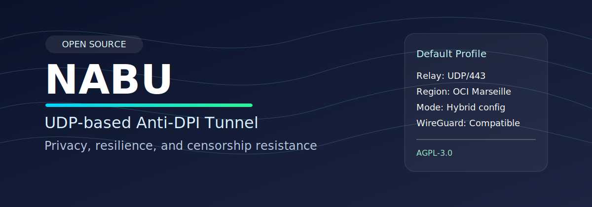

# NABU — UDP Tabanlı Anti-DPI Tünel

[](https://github.com/TuncayASMA/nabu/actions)
[](LICENSE)



> **⚠️ Geliştirme aşamasında — henüz production kullanımı için hazır değil.**

NABU, DPI tabanlı engellemelere karşı UDP/QUIC kullanan açık kaynak bir tünel projesidir.

## NABU Nedir?

NABU, istemci tarafında bir SOCKS5 çıkışı açıp trafiği şifreli ve obfuscation destekli
bir relay hattına taşıyan anti-DPI odaklı bir tünel katmanıdır.

Kısaca akış:

- Uygulama -> yerel SOCKS5
- SOCKS5 -> NABU istemci
- NABU istemci -> şifreli/obfuscation relay
- Relay -> hedef internet çıkışı

## Kimler İçin Uygun?

- DPI/sansür baskısı olan ağlarda erişim sürekliliği isteyen teknik kullanıcılar
- Kendi relay altyapısını yönetebilen bireyler/ekipler
- Açık kaynak, denetlenebilir tünel mimarisi tercih eden topluluklar

## Kullanım Şartları

- Yalnızca yerel mevzuata uygun ve yetkili kullanım senaryolarında kullanılmalıdır.
- Kullanıcı, kendi relay altyapısı ve trafik politikasından sorumludur.
- Ağ/altyapı kısıtları nedeniyle her ortamda aynı performans beklenmemelidir.
- Proje aktif geliştirme aşamasındadır; sürüm notları ve CI durumu takip edilmelidir.

## Gereksinimler

- İşletim sistemi: Linux (önerilen)
- Çalıştırma: Docker Compose veya native Go toolchain
- Ağ: relay'e UDP erişimi (varsayılan 7000/udp), istemci için 1080/tcp
- Kimlik: istemci ve relay arasında ortak PSK
- Opsiyonel: DNS sızıntı önleme için iptables/ip6tables yetkisi
- Opsiyonel: TLS/WSS/QUIC maskeleri için sertifika ve uygun port/policy ayarları

## Proje Amacı

- Sansürlü ağlarda güvenilir bağlantı sağlamak
- Trafiği gerçek internet davranışına benzeterek engel riskini düşürmek
- Topluluk tarafından geliştirilebilen, denetlenebilir bir altyapı sunmak

## Ne Yapacak?

- Yerelde SOCKS5 endpoint sunarak uygulamaları tünele bağlayacak
- Relay üzerinden şifreli UDP taşıma yapacak
- DNS sızıntısını önlemek için güvenli DNS taşıma modları sunacak
- İlerleyen fazlarda DPI tepki analizi ve çok yollu taşıma ekleyecek

## Özellikler (Yol Haritası)

- 🔐 AES-256-GCM şifreleme (ARM64 donanım hızlandırmalı)
- 🌊 Micro-Phantom trafik gizleme (gerçek HTTPS'ten ayırt edilemez)
- 📦 Reed-Solomon FEC (paket kayıplarında veri kurtarma)
- 🧅 SOCKS5 proxy arayüzü
- 🛡️ DNS sızıntı önleme (DoH/3)
- 🔍 Governor — gerçek zamanlı DPI tespiti

## Hızlı Başlangıç

```bash
# Henüz hazır değil — geliştirme devam ediyor
go install github.com/TuncayASMA/nabu/cmd/nabu-client@latest
```

## Varsayılan Kararlar

- Relay varsayılan UDP portu: `443`
- İlk demo relay lokasyonu: `OCI Marseille (fr-mrs-1)`
- İstemci konfig modeli: `hybrid` (dosya + CLI override)
- WireGuard uyumluluğu: açık (`--wg-compatible=true`)
- Org planı: şimdilik `TuncayASMA/nabu`, ilk dış katkı + 2 maintainer sonrasında `nabu-tunnel` org'a taşınacak

## Ne Kadar Detay Yeterli?

GitHub ana sayfasında kısa ve net bilgi yeterlidir.
Operasyonel ayrıntılar (sunucu topolojisi, saldırı modeli, test metodolojisi) için ayrı dokümanlar kullanılmalıdır.

## Derleme

```bash
git clone https://github.com/TuncayASMA/nabu
cd nabu
make build

# Tüm platformlar için
make build-all
```

## Testler

```bash
make test
make test-race

# Faz 2 + Faz 3 kapıları
make phase2-close
make dns-e2e

# Canlı öncesi tüm kapılar (preflight + test + build)
make rollout-live
```

## Katkı

AGPL-3.0 lisansı altında açık kaynak. Katkılar için [CONTRIBUTING.md](docs/CONTRIBUTING.md) belgesi yakında eklenecek.

## Lisans

[GNU Affero General Public License v3.0](LICENSE)
